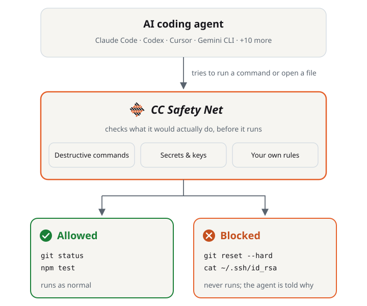

<h1>
  <picture>
    <source media="(prefers-color-scheme: dark)" srcset="./.github/assets/cc-safety-net-header-logo-dark.svg">
    <source media="(prefers-color-scheme: light)" srcset="./.github/assets/cc-safety-net-header-logo-light.svg">
    
  </picture>
</h1>

[](https://github.com/kenryu42/cc-safety-net/actions/workflows/ci.yml)
[](https://codecov.io/github/kenryu42/cc-safety-net)
[](https://github.com/kenryu42/cc-safety-net)
[](https://opensource.org/licenses/MIT)

<div align="center">

**English** · [简体中文](https://ccsafetynet.com/docs/zh-Hans) · [日本語](https://ccsafetynet.com/docs/ja)

https://github.com/user-attachments/assets/928dbe97-31e3-41d1-b35a-7941a701b056

</div>

CC Safety Net (Coding CLI Safety Net) blocks destructive commands and access to secrets such as SSH keys and `.env` files before the tool call runs. It parses what the command does. Wrapping the command or reordering flags does not hide it. A broken config file never blocks anything.

> [!NOTE]
> **[Full documentation →](https://ccsafetynet.com/docs)** covers installation, configuration, reference material, guides, and the security model. This README is the short version.

## How it works

<p align="center">
  <picture>
    <source media="(prefers-color-scheme: dark)" srcset="./.github/assets/how-it-works-dark.svg">
    <source media="(prefers-color-scheme: light)" srcset="./.github/assets/how-it-works-light.svg">
    
  </picture>
</p>

Details: [How It Works](https://ccsafetynet.com/docs/guides/how-it-works).

## Supported coding CLIs

CC Safety Net supports the coding agent CLIs below on Windows, macOS, and Linux. Automated tests cover the analyzer and some Windows integrations. Windows support for the remaining CLIs is best effort and has not been tested.

<table align="center">
  <tr>
    <td align="center"><a href="https://ccsafetynet.com/docs/installation#amp-code-installation"><picture><source media="(prefers-color-scheme: dark)" srcset="./.github/assets/amp-dark.svg"></picture><br>Amp Code</a></td>
    <td align="center"><a href="https://ccsafetynet.com/docs/installation#antigravity-cli-installation"><br>Antigravity CLI</a></td>
    <td align="center"><a href="https://ccsafetynet.com/docs/installation#claude-code-installation"><br>Claude Code</a></td>
    <td align="center"><a href="https://ccsafetynet.com/docs/installation#codex-installation"><br>Codex</a></td>
    <td align="center"><a href="https://ccsafetynet.com/docs/installation#cursor-installation"><picture><source media="(prefers-color-scheme: dark)" srcset="./.github/assets/cursor-dark.svg"></picture><br>Cursor</a></td>
  </tr>
  <tr>
    <td align="center"><a href="https://ccsafetynet.com/docs/installation#deepseek-harness-installation"><br>DeepSeek Harness</a></td>
    <td align="center"><a href="https://ccsafetynet.com/docs/installation#gemini-cli-installation"><br>Gemini CLI</a></td>
    <td align="center"><a href="https://ccsafetynet.com/docs/installation#github-copilot-cli-installation"><picture><source media="(prefers-color-scheme: dark)" srcset="./.github/assets/copilot-cli-dark.svg"></picture><br>GitHub Copilot CLI</a></td>
    <td align="center"><a href="https://ccsafetynet.com/docs/installation#grok-build-installation"><picture><source media="(prefers-color-scheme: dark)" srcset="./.github/assets/grok-build-dark.svg"></picture><br>Grok Build</a></td>
    <td align="center"><a href="https://ccsafetynet.com/docs/installation#hermes-agent-installation"><br>Hermes Agent</a></td>
  </tr>
  <tr>
    <td align="center"><a href="https://ccsafetynet.com/docs/installation#kimi-code-installation"><br>Kimi Code</a></td>
    <td align="center"><a href="https://ccsafetynet.com/docs/installation#openclaw-installation"><br>OpenClaw</a></td>
    <td align="center"><a href="https://ccsafetynet.com/docs/installation#opencode-installation"><picture><source media="(prefers-color-scheme: dark)" srcset="./.github/assets/opencode-dark.svg"></picture><br>OpenCode</a></td>
    <td align="center"><a href="https://ccsafetynet.com/docs/installation#pi-installation"><br>Pi</a></td>
  </tr>
</table>

Amp documents macOS, Linux, and WSL, but not native Windows.

## Features

- **Blocks destructive commands** such as `git reset --hard`, `git push --force`, and `rm -rf` on dangerous targets, even inside `bash -c` or `python -c`. See [Blocked Commands](https://ccsafetynet.com/docs/reference/blocked-commands) and [vs Sandboxing](https://ccsafetynet.com/docs/guides/vs-sandboxing).
- **Blocks secret access** to SSH keys, `.env` files, `~/.aws`, and coding-CLI credentials, from the shell and from the agent's file tools. See [Secret Protection](https://ccsafetynet.com/docs/reference/secret-protection).
- **Customizes the rules in a GUI.** Run `npx cc-safety-net gui` and open Policy. See [Policy](https://ccsafetynet.com/docs/configuration/policy).
- **Adds blocks through rulebooks**: official packs for Terraform, AWS, gcloud, and Azure, or your own JSON. See [Official Rulebooks](https://ccsafetynet.com/docs/configuration/rulebooks).
- **Shares policy through git.** Commit `.cc-safety-net/` so clones and cloud sessions get the same rules. See [Team Setup](https://ccsafetynet.com/docs/guides/team-setup).
- **Embeds in your own tools** through the [Library API](#library-api).

## Quick start

You need Node.js 18 or higher. Install into the coding CLIs on this machine:

```bash
npx -y cc-safety-net@latest install
```

Update every installed integration with `npx -y cc-safety-net@latest update`, and uninstall with `npx -y cc-safety-net uninstall`. Keep the `@latest` qualifier: a bare `cc-safety-net` spec can run an older copy from the npx cache.

Per-CLI requirements and options are in [Installation](https://ccsafetynet.com/docs/installation).

> [!WARNING]
> Upgrading from a legacy inline config such as `.safety-net.json` or `~/.cc-safety-net/config.json`? Those files are no longer loaded, so their rules enforce nothing. Run `npx -y cc-safety-net rule migrate`, then confirm `npx -y cc-safety-net doctor` reports `ready`. See the [migration guide](https://ccsafetynet.com/docs/configuration/custom-rules#migrate-legacy-configuration).

## Safety presets

Set a preset in `npx cc-safety-net gui` under Policy.

| Preset | Effect |
|---|---|
| Standard | Blocks recognizable destructive Git and filesystem commands. Recommended for normal coding. |
| Strict | Standard, plus blocks dynamic or unparseable commands the analyzer cannot verify safely. |
| Paranoid | Strict, plus blocks `rm -rf` inside your project and interpreter one-liners. For untrusted agents or high-stakes repos. |

See [Modes](https://ccsafetynet.com/docs/configuration/modes).

## Diagnostics

```bash
npx cc-safety-net status                       # what is being enforced right now
npx cc-safety-net doctor                       # verify the installation and run a self-test
npx cc-safety-net explain "git reset --hard"   # trace how a command is analyzed
npx cc-safety-net logs                         # recorded denials from the local audit trail
```

See [CLI Commands](https://ccsafetynet.com/docs/reference/cli-commands) and [Troubleshooting](https://ccsafetynet.com/docs/guides/troubleshooting).

## The cc-safety-net skill

Ask the skill anything about the tool: why a command was blocked, how to write a rule, or whether protection is working. It ships with the Claude Code and Codex plugins and is built into the OpenCode and Pi integrations.

```text
/cc-safety-net why was my last git command blocked
```

## Library API

To check a command from Node.js without installing the hook:

```ts
import { checkCommand } from 'cc-safety-net/api';

const result = checkCommand({ command: 'git status', cwd: process.cwd() });
if (result.kind !== 'allow') {
  throw new Error(result.reason);
}
```

`cwd` must be an absolute directory path. If `checkCommand` throws, do not run the command. See [Embedding](https://ccsafetynet.com/docs/guides/embedding).

## Limitations

CC Safety Net denies a tool call before it runs. It is not a sandbox: it does not set filesystem permissions, watch network egress, or contain a process. See [Known Limitations](https://ccsafetynet.com/docs/guides/known-limitations) and the residual-risk registry in [SECURITY.md](SECURITY.md).

## Documentation

The **[ccsafetynet.com/docs](https://ccsafetynet.com/docs)** site contains the full documentation:

| Area | Pages |
|---|---|
| Get started | [Introduction](https://ccsafetynet.com/docs/introduction) · [Installation](https://ccsafetynet.com/docs/installation) · [Quickstart](https://ccsafetynet.com/docs/quickstart) · [Team Setup](https://ccsafetynet.com/docs/guides/team-setup) · [Cloud Environments](https://ccsafetynet.com/docs/guides/cloud-environments) · [How It Works](https://ccsafetynet.com/docs/guides/how-it-works) · [Dashboard](https://ccsafetynet.com/docs/guides/dashboard) |
| Configuration | [Modes](https://ccsafetynet.com/docs/configuration/modes) · [Policy](https://ccsafetynet.com/docs/configuration/policy) · [Environment](https://ccsafetynet.com/docs/configuration/environment) · [Custom Rules](https://ccsafetynet.com/docs/configuration/custom-rules) · [Official Rulebooks](https://ccsafetynet.com/docs/configuration/rulebooks) · [Status Line](https://ccsafetynet.com/docs/configuration/status-line) · [Configuration Recovery](https://ccsafetynet.com/docs/configuration/recovery) |
| Reference | [Blocked Commands](https://ccsafetynet.com/docs/reference/blocked-commands) · [Allowed Commands](https://ccsafetynet.com/docs/reference/allowed-commands) · [Secret Protection](https://ccsafetynet.com/docs/reference/secret-protection) · [Audit Log](https://ccsafetynet.com/docs/reference/audit-log) · [CLI Commands](https://ccsafetynet.com/docs/reference/cli-commands) · [Explain Trace](https://ccsafetynet.com/docs/reference/explain-trace) · [Glossary](https://ccsafetynet.com/docs/reference/glossary) |
| Guides | [Architecture](https://ccsafetynet.com/docs/guides/architecture) · [Analysis Engine](https://ccsafetynet.com/docs/guides/analysis-engine) · [Design Principles](https://ccsafetynet.com/docs/guides/design-principles) · [Security Model](https://ccsafetynet.com/docs/guides/security-model) · [vs Sandboxing](https://ccsafetynet.com/docs/guides/vs-sandboxing) · [Integration Architecture](https://ccsafetynet.com/docs/guides/integration-architecture) · [Embedding](https://ccsafetynet.com/docs/guides/embedding) · [Known Limitations](https://ccsafetynet.com/docs/guides/known-limitations) · [Troubleshooting](https://ccsafetynet.com/docs/guides/troubleshooting) |
| Project | [Contributing](https://ccsafetynet.com/docs/contributing) · [Security Policy](https://ccsafetynet.com/docs/security) |

## Development

See [CONTRIBUTING.md](CONTRIBUTING.md) to contribute to the project.

## License

MIT
